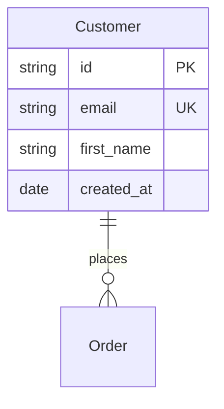
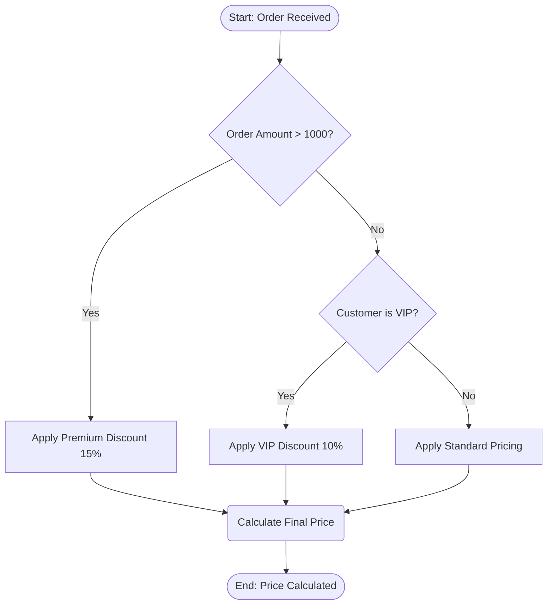
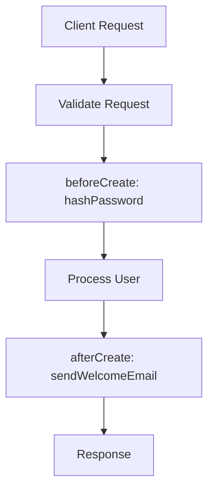

# APPWITHAI Modeling Language (EML)

**EML** is a single, standalone, Mermaid-based language for describing an
application's **Entity Relationship Diagram (ERD)**, its **business rules**, and
its **business workflows** — all in one artifact that the APPWITHAI generator
reads to produce full-stack applications.

> **This folder sits at the root of the combined repository**, above both
> products, because both read the same language:
>
> | Consumer | What it does with a model |
> |---|---|
> | [`app-with-ai-tanstack/`](../app-with-ai-tanstack/) | Generates a whole application — NestJS + Fastify + Kysely backend, TanStack Start front end, seeds, dictionary, manual. Also runs the modelling tool and the browser (WASM) stack |
> | [`enterprise_reporting_tanstack/`](../enterprise_reporting_tanstack/) | Takes the same model as *entities to report on*. `--stack enterprise-reporting` emits TanStack Start server functions, list/detail routes and a Kysely migration shaped to drop into that repository, whose reporting, charting, NL-query and RBAC machinery already exists |
>
> One language, one checker, one set of examples. Where a path below reads
> `packages/…`, it is inside `app-with-ai-tanstack/`, which is where the shipped
> generator lives.

Every EML document is **valid, renderable Mermaid**. EML is a *semantic superset*:
it assigns generator meaning to standard Mermaid diagrams (`erDiagram`,
`flowchart`, `stateDiagram-v2`) and to renderer-safe `%%` directive comments.

> Inspired by the official Mermaid references for
> [Entity Relationship Diagrams](https://mermaid.js.org/syntax/entityRelationshipDiagram.html)
> and [Flowcharts](https://mermaid.js.org/syntax/flowchart.html).

---

## The definition file

The **full language** is defined in one machine-readable file that the
generator application reads:

```
language/appwithai-language.json
```

This JSON is the **single source of truth** for the language: type vocabulary,
modifiers, relationship cardinalities, hook types, rule-node shape semantics,
directives, grammar, and the generator contract. Everything else in this folder
documents or loads that file.

Load it from code via the typed accessor:

```ts
import {
  loadLanguageDefinition,
  normalizeType,
  cardinalityKind,
  isHookType,
} from "../language";

const def = loadLanguageDefinition();
normalizeType("varchar");     // "string"
cardinalityKind("||--o{");    // "oneToMany"
isHookType("beforeCreate");   // true
```

---

## Folder layout

```
language/
├── README.md                     # This entry point
├── appwithai-language.json       # ⭐ Canonical, machine-readable definition (the language)
├── index.ts                      # Typed loader/accessor for the generator app
├── composer.ts                   # Writes a complete EML document (composeEml, mergeSections)
├── rag.ts                        # EML → retrieval chunks; copied into generated apps verbatim
├── checker.ts                    # Validator — `bun language/checker.ts <file.mmd>`
├── fixer.ts                      # Applies the checker's auto-fixable codes
├── grammar/
│   └── appwithai.ebnf            # Formal EBNF grammar
├── spec/
│   ├── 00-overview.md            # Concepts, document structure, sections
│   ├── 01-erd.md                 # ERD reference
│   ├── 02-business-rules.md      # Business-rules (decision-flow) reference
│   ├── 03-workflows.md           # Workflow (hooks + state) reference
│   ├── 04-types-and-modifiers.md # Type vocabulary, modifiers, cardinalities
│   └── 05-directives.md          # Reserved %% directive reference
├── cli/                          # The `eml` CLI — parse, validate, generate apps
│   ├── README.md
│   ├── eml.ts                    # Executable entrypoint (run with Bun)
│   ├── src/                      # parser, validator, model, generators
│   │   └── generate/
│   │       ├── app.ts            #   --stack node-rest
│   │       ├── tanstack.ts       #   --stack tanstack-nestjs (drives the shipped orchestrator)
│   │       ├── enterprise-reporting.ts  # --stack enterprise-reporting
│   │       ├── jdm.ts            #   rules → GoRules JDM, all stacks
│   │       ├── docker.ts, ci.ts, github.ts
│   └── runtime/                  # static runtime for generated apps
└── examples/
    ├── crm.eml.mmd               # Enterprise CRM — the reference model: 17 entities,
    │                             #   8 rules, 5 state machines, 7 hook workflows, 5 sagas
    ├── dance-studio.eml.mmd      # Carries all 25 behaviour constructs in one model
    ├── ecommerce.eml.mmd         # Full e-commerce model
    ├── helpdesk.eml.mmd          # Support-ticketing model (used by the CLI test)
    └── minimal.eml.mmd           # Smallest complete example
```

These four are checked in twice — `language/examples/*.eml.mmd` and
`html/models/*.eml.mmd` must stay byte-identical, and CI asserts it. Edit both.

The repository root's [`examples/`](../examples/) folder is the other one, and it
carries no such constraint:

| Model | For |
|---|---|
| `analytics-reporting.eml.mmd` | The reporting domain — data sources, saved queries, reports, charts, dashboards, scheduled deliveries. Written for `--stack enterprise-reporting`, and generates cleanly under `tanstack-nestjs` too |
| `drug-discovery.eml.mmd` | The model CI generates and builds |
| `investment-planning-wealth-management-system.eml.mmd` | A large worked model |
| `clinic.*`, `ecommerce.erd.mmd`, `simple.erd.mmd`, … | ERD-only sketches |

## The `eml` CLI — build an app from a model

The [`cli/`](cli/README.md) folder holds a zero-dependency TypeScript CLI that
reads this definition, parses an `.mmd` model, validates it **with
self-correction**, and **generates a complete, runnable application**:

```bash
bun language/cli/eml.ts validate -i language/examples/helpdesk.eml.mmd
bun language/cli/eml.ts generate -i language/examples/helpdesk.eml.mmd -o ./out --docker
cd out && npm start        # zero-dependency app on http://localhost:3000
```

It supports `--input`, `--output`, `--name`, `--docker`, `--github <owner/repo>`,
`--stack`, `--force`, `--no-autofix`, `--json`, and `--help`. See
[`cli/README.md`](cli/README.md).

### The three `--stack` targets

| `--stack` | Emits | Standalone? |
|---|---|---|
| `node-rest` *(default)* | A dependency-free `node:http` app over a JSON-file datastore | Yes — `npm start`, no install |
| `tanstack-nestjs` | The full stack: NestJS + Fastify + Kysely backend, TanStack Start front end, migrations, seeds, dictionary, manual (~356 files). Drives the shipped orchestrator in `app-with-ai-tanstack/packages/generator` | Yes |
| `enterprise-reporting` | TanStack Start **server functions** (`.inputValidator()`), list/detail routes (shadcn/ui + TanStack Table), a Kysely **PostgreSQL** migration, and a `Database`-interface snippet | **No** — it is code to drop into an `enterprise_reporting_tanstack` checkout |

```bash
# Application, whole and standalone
bun language/cli/eml.ts generate -i language/examples/crm.eml.mmd -o ./out --stack tanstack-nestjs

# Entities for the reporting platform
bun language/cli/eml.ts generate -i language/examples/crm.eml.mmd -o ./out --stack enterprise-reporting
```

`enterprise-reporting` is the target that generates *less* on purpose. The
reporting repository already has auth, two-layer RBAC, the encrypted data-source
connection manager, the NL-query pipeline, the job runner and the UI shell; a
generated copy of any of those would be a fork of a moving part. So the target
emits only what a new entity actually needs, and its `README.md` names the five
integration steps — including the one nothing can do for you, which is adding the
`<resource>:<action>` permission strings to the roles that should hold them.

Three conventions of that repository are load-bearing, and getting them right
every time is most of why the target exists:

1. **`.inputValidator()`, never `.validator()`.** The TanStack Start v1 Vite
   plugin preserves unknown method names verbatim in the client bundle, so
   `.validator()` type-checks, builds, and then crashes at runtime.
2. **A client call passes `{ data: input }`** whenever the server function
   declares an input validator.
3. **The config database is PostgreSQL only.** The DDL is Postgres — `TIMESTAMPTZ`,
   `BOOLEAN`, `JSONB`, `NUMERIC`, `gen_random_uuid()`, double-quoted identifiers.
   Several files under that repository's `docs/` still describe MariaDB or
   SQLite; none of it is in the running system.

The shipped ERD parser
(`app-with-ai-tanstack/packages/generator/src/parsers/mermaid.parser.ts`) also
loads its type and cardinality maps from `appwithai-language.json` at runtime, so
the generator and the language definition never drift. The `enterprise-reporting`
target reads the same parsed model — it differs in what it writes, not in what it
understands, so a directive that changes meaning changes it for both.

---

## The three sections at a glance

### 1. ERD — structure



Parsed by `packages/generator/src/parsers/mermaid.parser.ts`.

### 2. Business rules — declarative decision logic



Node **shape** = decision role → compiled to a GoRules **JDM** graph by
`packages/generator/src/rules/jdm-converter.ts`. A section carrying `%%action`
directives compiles to a JDM *decision table* instead — that is the shape the
rules engine reads actions from.

### 3. Workflows — lifecycle hooks & process orchestration



`%%hook` directives are compiled by `packages/generator/src/hooks/index.ts`
into per-entity handler modules plus a registry the generated bus service calls
around every CRUD operation.

The web app keeps its own parsers for the editors — they run in the browser and
cannot import the generator. They read the same syntax but do not decide what is
generated; when the two disagree, the generator's copy is the language.

---

## Conformance levels

| Level | Covers | Status |
|-------|--------|--------|
| **core** | `erDiagram` entities, attributes, `PK/FK/UK/OPTIONAL/NULL/UNIQUE`, all 8 cardinalities, plus `%%index`, `%%enum`, `%%field enum:` and `%%category` | Compiled |
| **rules** | `flowchart` decision flows → JDM via shape semantics; `%%action` → JDM decision table | Compiled |
| **workflows** | `%%hook` (both forms, all 13 types), `stateDiagram-v2` state machines, `%%workflow kind: saga` with `%%step` and `%%loop` | Compiled |
| **access** | `%%rbac`, in both its CRUD and state-transition forms | Compiled to `sys_operation_access` / `sys_transition_access`, enforced by the generated guard |
| **help** | `%%field <E>.<col> help:` and `%%entity <Name> help:` (or `description:`) | Compiled — to `sys_column.description` / `sys_table.description`, shown in the app, and the whole "what it is for" column of `manual.html` |
| **validated** | `%%rule`, `%%trigger`, and the `%%entity` keys other than `help:`/`description:` | No compiler yet; `checker.ts` enforces syntax so a malformed one fails rather than being dropped |
| **reserved** | `%%field` keys other than `enum:` and `help:` | Renderer-safe, documented, inert |

`help` is a level of its own because it is the one that gets skipped. It reads
like documentation, so it is easy to leave for later — and then the generated
manual prints a dash in every row, which is the first thing anyone opening the
application sees. Write it on every column, not only the ambiguous ones.

Each directive also carries its own `status` and `consumedBy` in
`appwithai-language.json`, which is authoritative for that directive; the levels
above just group them.

### What each level means per stack

The levels describe the language, not any one target, and the targets do not all
reach the same distance into it. State this plainly rather than letting a model
author assume otherwise:

| Level | `tanstack-nestjs` | `enterprise-reporting` | `node-rest` |
|---|---|---|---|
| **core** (entities, fields, enums, indexes) | Compiled | Compiled — tables, Zod schemas, forms, columns | Compiled |
| **rules** | Compiled — seeded and evaluated by the rules engine | Emitted as JDM under `rules/`, **not wired up** | Emitted as JDM |
| **workflows** (hooks, state machines, sagas) | Compiled — handlers, transitions, guard enforcement | **Not compiled** | Not compiled |
| **access** (`%%rbac`) | Compiled — `sys_operation_access` / `sys_transition_access` | **Not compiled** — the generated handlers call `requireAuth()`; add `requirePermission()` and the role strings yourself | Not compiled |
| **help** | Compiled — dictionary and `manual.html` | Field labels only | Not compiled |

An `enterprise-reporting` model is therefore worth writing in full anyway: the
behaviour a target skips today is still what the checker validates, what the
viewers render, and what the other target compiles from the same file.

See `spec/` for the full reference and `appwithai-language.json` for the
machine-readable contract.

For the whole system — the generator, its templates, and what a generated
application contains — see [`../website/llmtext/llms-full.txt`](../website/llmtext/llms-full.txt),
which is the same material written as one context file for language models.
